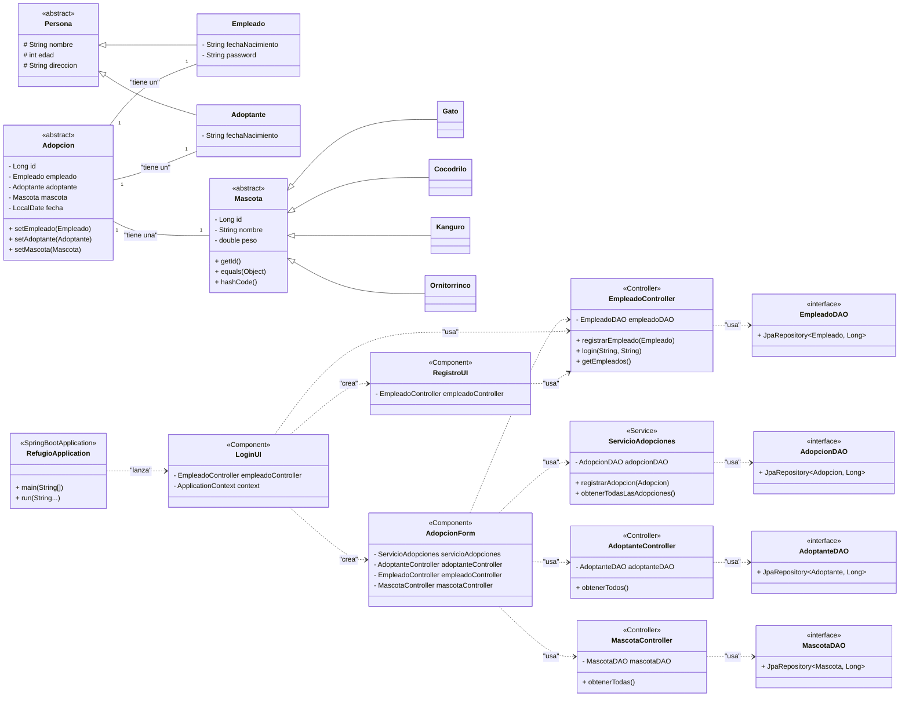

```mermaid
classDiagram
    direction LR

    class Persona {
        <<abstract>>
        # String nombre
        # int edad
        # String direccion
    }

    class Empleado {
        - String fechaNacimiento
        - String password
    }
    Persona <|-- Empleado

    class Adoptante {
        - String fechaNacimiento
    }
    Persona <|-- Adoptante

    class Mascota {
        <<abstract>>
        - Long id
        - String nombre
        - double peso
        + getId()
        + equals(Object)
        + hashCode()
    }
    Mascota <|-- Gato
    Mascota <|-- Cocodrilo
    Mascota <|-- Kanguro
    Mascota <|-- Ornitorrinco

    class Adopcion {
        <<abstract>>
        - Long id
        - Empleado empleado
        - Adoptante adoptante
        - Mascota mascota
        - LocalDate fecha
        + setEmpleado(Empleado)
        + setAdoptante(Adoptante)
        + setMascota(Mascota)
    }
    Adopcion "1" -- "1" Empleado : "tiene un"
    Adopcion "1" -- "1" Adoptante : "tiene un"
    Adopcion "1" -- "1" Mascota : "tiene una"

    class AdopcionDAO {
        <<interface>>
        + JpaRepository~Adopcion, Long~
    }

    class MascotaDAO {
        <<interface>>
        + JpaRepository~Mascota, Long~
    }

    class EmpleadoDAO {
        <<interface>>
        + JpaRepository~Empleado, Long~
    }

    class AdoptanteDAO {
        <<interface>>
        + JpaRepository~Adoptante, Long~
    }

    class EmpleadoController {
        <<Controller>>
        - EmpleadoDAO empleadoDAO
        + registrarEmpleado(Empleado)
        + login(String, String)
        + getEmpleados()
    }
    EmpleadoController ..> EmpleadoDAO : "usa"

    class MascotaController {
        <<Controller>>
        - MascotaDAO mascotaDAO
        + obtenerTodas()
    }
    MascotaController ..> MascotaDAO : "usa"

    class AdoptanteController {
        <<Controller>>
        - AdoptanteDAO adoptanteDAO
        + obtenerTodos()
    }
    AdoptanteController ..> AdoptanteDAO : "usa"

    class ServicioAdopciones {
        <<Service>>
        - AdopcionDAO adopcionDAO
        + registrarAdopcion(Adopcion)
        + obtenerTodasLasAdopciones()
    }
    ServicioAdopciones ..> AdopcionDAO : "usa"

    class AdopcionForm {
        <<Component>>
        - ServicioAdopciones servicioAdopciones
        - AdoptanteController adoptanteController
        - EmpleadoController empleadoController
        - MascotaController mascotaController
    }
    AdopcionForm ..> ServicioAdopciones : "usa"
    AdopcionForm ..> AdoptanteController : "usa"
    AdopcionForm ..> EmpleadoController : "usa"
    AdopcionForm ..> MascotaController : "usa"

    class LoginUI {
        <<Component>>
        - EmpleadoController empleadoController
        - ApplicationContext context
    }
    LoginUI ..> EmpleadoController : "usa"
    LoginUI ..> AdopcionForm : "crea"

    class RegistroUI {
        <<Component>>
        - EmpleadoController empleadoController
    }
    RegistroUI ..> EmpleadoController : "usa"
    LoginUI ..> RegistroUI : "crea"

    class RefugioApplication {
        <<SpringBootApplication>>
        + main(String[])
        + run(String...)
    }
    RefugioApplication ..> LoginUI : "lanza"

```